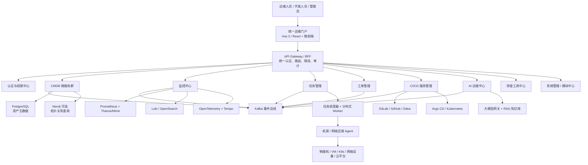
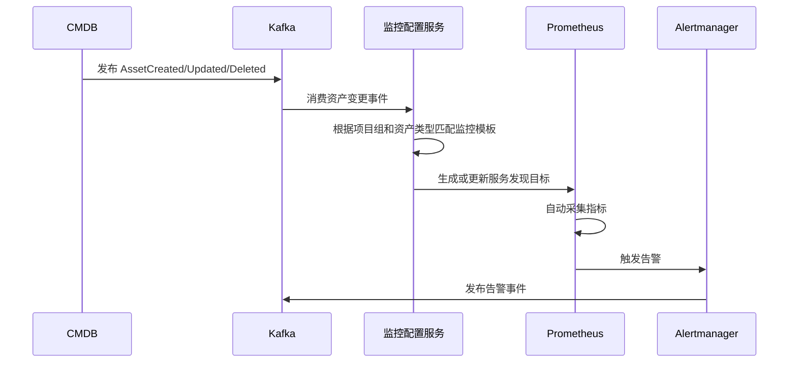

下面给出一套面向“千台级服务器、多集群、多云环境”的运维自动化平台架构。核心原则是：

- CMDB 是唯一资产数据源，但其他模块不直接访问 CMDB 数据库。
- 模块之间通过 API + 事件总线协作。
- 所有业务模块独立微服务部署。
- 前端采用模块化、可插拔机制。
- 采集、监控和任务执行采用分布式 Agent，避免中心节点成为瓶颈。
- AI 运维默认只提供分析和建议，高风险操作必须审批。

## 一、总体架构



## 二、微服务模块划分

建议不要简单地做成“一个模块一个大服务”，而是按照业务边界拆分。

| 业务域 | 建议微服务 | 主要职责 |
|---|---|---|
| CMDB | 资产服务 | 服务器、虚拟机、网络设备、云资源等资产管理 |
| CMDB | IDC资源服务 | 机房、模块组、区域、机柜、U位、电力信息 |
| CMDB | K8s资源服务 | 集群、Node、Namespace、Workload、Service、Pod |
| CMDB | 云资源同步服务 | 对接阿里云、腾讯云、华为云、AWS、VMware、OpenStack |
| CMDB | 自动发现服务 | Agent、SNMP、IPMI、云API、K8s API资源发现 |
| CMDB | 关系与拓扑服务 | 资产关系、依赖关系、网络拓扑和业务拓扑 |
| CMDB | 标签与组织服务 | 项目组、环境、应用、负责人、成本中心、标签 |
| 监控 | 监控配置服务 | 监控模板、指标、采集策略、目标管理 |
| 监控 | 告警服务 | 告警规则、聚合、抑制、降噪、升级 |
| 监控 | 通知服务 | 短信、邮件、钉钉、企业微信、Webhook |
| 监控 | 可观测查询服务 | 指标、日志、链路统一查询 |
| 任务 | 作业编排服务 | 脚本、命令、Ansible、流程编排 |
| 任务 | 调度服务 | 定时任务、依赖任务、批量执行 |
| 任务 | 执行服务 | Agent任务下发、回执、超时和重试 |
| 工单 | 流程服务 | BPMN流程、审批、转派、会签 |
| 工单 | 工单服务 | 事件、变更、发布、权限申请、资源申请 |
| CI/CD | 流水线服务 | 构建、制品、部署、回滚记录 |
| CI/CD | 发布服务 | Kubernetes发布、灰度、蓝绿、滚动发布 |
| AI运维 | AI网关 | 模型调用、鉴权、配额、审计 |
| AI运维 | 分析服务 | 告警归因、日志分析、故障摘要 |
| AI运维 | 知识服务 | 运维文档、历史工单、故障案例、Runbook |
| 排查工具 | 工具编排服务 | Ping、端口检测、DNS、路由、日志检索、K8s诊断 |
| 系统管理 | 模块中心 | 模块注册、启停、菜单和前端入口 |
| 系统管理 | 权限中心 | 用户、部门、项目组、角色、数据权限 |
| 系统管理 | 审计服务 | 登录、配置变更、命令执行、数据导出审计 |

初期可以将低访问量服务合并部署，逻辑边界保持独立即可，避免一开始拆出几十套难以维护的服务。

## 三、CMDB 核心设计

### 1. 统一资源模型

建议抽象为四类核心对象：

```text
CI类型
  ├─ 位置：园区、机房、模块组、机柜、U位
  ├─ 计算：物理机、虚拟机、云主机、K8s Node
  ├─ 网络：交换机、路由器、防火墙、负载均衡、网卡、IP
  └─ 应用：项目、应用、服务、实例、数据库、中间件

CI实例
  ├─ 标准属性
  ├─ 扩展属性
  ├─ 标签
  ├─ 所属项目组
  ├─ 数据来源
  └─ 生命周期状态

关系
  ├─ 位于
  ├─ 运行于
  ├─ 包含
  ├─ 连接
  ├─ 依赖
  └─ 属于
```

关键关系示例：

```text
机房 → 模块组 → 机柜 → 物理服务器
物理服务器 → 虚拟机
云平台 → 区域 → 可用区 → 云主机
K8s集群 → Node → Pod
项目组 → 应用 → 服务 → 实例
交换机端口 → 服务器网卡 → IP → 服务实例
```

### 2. 数据存储

推荐：

- PostgreSQL：CMDB 主数据、配置、权限、工单和任务记录。
- Redis：缓存、分布式锁、短期状态。
- OpenSearch：复杂资产检索、全文搜索、审计检索。
- Neo4j：可选，用于多层拓扑和影响分析。
- S3/MinIO：任务输出、日志归档、附件、制品。
- Kafka：资产变更、告警、任务、工单等领域事件。

CMDB 的资产主数据仍以 PostgreSQL 为准，Neo4j 只作为关系查询投影，避免出现两个“真相来源”。

### 3. 数据接入与校验

数据来源包括：

- Agent 自动上报。
- VMware vCenter、OpenStack和公有云API。
- Kubernetes API。
- SNMP、LLDP、CDP、ARP、MAC地址表。
- IPMI/Redfish。
- Excel批量导入。
- 人工维护。
- 采购、财务、ITSM系统同步。

每条数据需要记录：

```text
source        数据来源
source_id     来源侧唯一编号
last_seen_at  最后发现时间
confidence    数据可信度
owner         数据负责人
version       数据版本
```

需要提供冲突处理、重复资产合并、字段校验、过期资产标记和变更审计。

## 四、自动拓扑实现

拓扑不能只靠 CMDB 人工关系，应由多来源关系共同生成：

1. 物理拓扑：SNMP、LLDP/CDP、交换机端口和MAC表。
2. 虚拟化拓扑：vCenter/OpenStack宿主机与虚拟机关系。
3. K8s拓扑：Cluster、Node、Workload、Pod、Service、Ingress。
4. 网络拓扑：IP、网卡、VLAN、交换机、路由器、防火墙。
5. 应用拓扑：OpenTelemetry调用链、网关访问日志、服务注册中心。
6. 业务拓扑：项目组、应用、服务和基础设施关系。

前端使用 Cytoscape.js 或 AntV G6 展示，拓扑服务负责：

- 节点聚合和分层。
- 路径查询。
- 上下游依赖。
- 故障影响范围。
- 实时告警着色。
- 历史拓扑快照。

## 五、监控中心与 CMDB 联动

推荐采用“事件驱动的监控目标生成”，不要让监控中心持续全量查询 CMDB。



资产进入 CMDB 后，根据以下标签自动分类：

```text
project_id
project_group
application
service
environment
region
idc
asset_type
owner
importance
```

监控模板示例：

- Linux服务器：Node Exporter。
- Windows服务器：Windows Exporter。
- 网络设备：SNMP Exporter。
- VMware：vCenter Exporter。
- Kubernetes：kube-state-metrics、cAdvisor。
- MySQL/Redis/Nginx：对应Exporter。
- 应用服务：OpenTelemetry和业务指标。

Prometheus 支持 Kubernetes、云平台以及文件/HTTP等多种服务发现方式；CMDB 可以向监控系统输出标准目标和标签。[Prometheus配置文档](https://prometheus.io/docs/prometheus/latest/configuration/configuration/)

千台级建议：

- 按项目组、机房或区域拆分采集分片。
- 每个区域部署监控 Agent/Collector。
- Prometheus双实例高可用。
- Thanos或Mimir用于全局查询和长期存储。
- Alertmanager集群负责告警。
- 禁止将IP、请求ID等高变化数据随意作为指标标签，控制指标基数。

日志采用 Loki 或 OpenSearch；Loki支持横向扩展的微服务部署，并可将数据写入对象存储。[Loki架构文档](https://grafana.com/docs/loki/latest/get-started/architecture/)

指标、日志和链路的采集入口建议统一使用 OpenTelemetry Collector，其接收、处理、导出流水线适合多区域部署。[OpenTelemetry Collector架构](https://opentelemetry.io/docs/collector/architecture/)

## 六、任务管理设计

任务系统建议采用“控制面 + 区域执行节点 + 主机Agent”：

```text
任务API
  → 作业编排
  → 调度器
  → Kafka任务队列
  → 区域Worker
  → 主机Agent / SSH / WinRM / K8s API
  → 结果与日志回传
```

执行能力包括：

- Shell、PowerShell、Python。
- Ansible Playbook。
- Kubernetes Job。
- API调用。
- 数据库脚本。
- 文件分发。
- 服务启停。
- 灰度批次执行。
- 失败暂停和自动回滚。

必须具备：

- 命令黑白名单。
- 高危命令拦截。
- 审批授权。
- 执行前快照。
- 分批执行和并发限制。
- 超时、重试、取消。
- 全量操作审计。
- 敏感参数加密。
- Agent双向TLS认证。

## 七、可插拔模块和前端设计

前端建议采用“门户壳应用 + 模块清单”的方式，不一定需要把所有模块都做成复杂微前端。

模块注册信息：

```json
{
  "code": "monitor-center",
  "name": "监控中心",
  "frontendEntry": "/modules/monitor/",
  "backendRoute": "/api/monitor/",
  "healthUrl": "/actuator/health",
  "permissions": ["monitor:view", "monitor:manage"],
  "dependencies": ["cmdb"],
  "enabled": true
}
```

系统管理的模块中心负责：

- 模块注册和版本管理。
- 启用、禁用。
- 菜单动态加载。
- API路由动态配置。
- 权限点注册。
- 模块依赖检查。
- 健康状态检查。
- 租户或项目组可见范围。

建议区分两个概念：

- “启用模块”：控制菜单、权限、路由和业务开放。
- “部署模块”：通过 Helm/Argo CD 安装真正的微服务。

不要让普通管理员直接从页面任意启动容器。模块中心应提交一份声明式配置，由 GitOps 系统部署。Argo CD 会持续比较集群实际状态和 Git 中的目标状态，并支持同步与回滚。[Argo CD架构](https://argo-cd.readthedocs.io/en/stable/operator-manual/architecture/)

## 八、CI/CD 服务管理

推荐流程：

```text
代码提交
 → GitLab CI / Jenkins
 → 单元测试与安全扫描
 → 构建镜像
 → Harbor镜像仓库
 → 更新Helm配置仓库
 → Argo CD同步
 → Kubernetes发布
 → CMDB更新应用实例
 → 监控中心自动纳管
```

平台重点管理：

- 应用、服务、环境和集群映射。
- 流水线状态。
- 镜像与制品版本。
- 发布批次。
- 发布审批。
- 灰度和蓝绿发布。
- 一键回滚。
- 发布记录与CMDB关联。

## 九、AI 运维模块

AI运维建议定位为“分析与受控执行助手”：

- 告警摘要和聚合。
- 日志异常分析。
- 指标趋势分析。
- 结合CMDB拓扑进行故障影响分析。
- 查询历史故障与工单。
- 推荐排查步骤和Runbook。
- 自然语言生成监控查询。
- 自动生成故障复盘报告。
- 经审批后调用任务平台执行操作。

推荐架构：

```text
用户问题
 → AI网关
 → 权限与数据范围检查
 → CMDB/监控/日志/工单检索工具
 → RAG知识库
 → 大模型分析
 → 生成结论和操作建议
 → 人工确认
 → 任务平台执行
```

AI不能直接连接服务器，也不能直接读取业务数据库密码。它只能调用经过白名单注册的平台工具，并且每次调用都必须审计。

## 十、推荐技术栈

| 层次 | 推荐技术 |
|---|---|
| 前端 | Vue 3 + TypeScript + Vite + Pinia + Ant Design Vue |
| 微前端 | qiankun或Module Federation；初期也可采用动态路由模块 |
| 网关 | APISIX或Kong |
| 后端 | Java 21 + Spring Boot 3，或Go用于高并发采集服务 |
| 服务通信 | REST对外，gRPC用于内部高频通信 |
| 消息总线 | Kafka |
| 主数据库 | PostgreSQL |
| 缓存 | Redis Cluster/Sentinel |
| 搜索 | OpenSearch |
| 图关系 | Neo4j，可选 |
| 工作流 | Flowable/Camunda |
| 任务执行 | Ansible Runner + 自研调度服务 |
| 容器平台 | Kubernetes |
| 部署 | Helm + Argo CD |
| 镜像仓库 | Harbor |
| 指标 | Prometheus + Thanos/Mimir + Grafana |
| 告警 | Alertmanager |
| 日志 | Loki或OpenSearch |
| 链路 | OpenTelemetry + Tempo |
| 认证 | Keycloak，对接LDAP/AD/OIDC |
| 密钥 | Vault或Kubernetes External Secrets |
| 对象存储 | MinIO/S3 |
| 拓扑前端 | Cytoscape.js或AntV G6 |

所有微服务运行在 Kubernetes 中，关键无状态服务至少两个副本，并通过HPA按CPU、自定义指标或队列积压扩缩容。Kubernetes原生支持根据资源及自定义指标调整工作负载副本数。[Kubernetes HPA文档](https://kubernetes.io/docs/concepts/workloads/autoscaling/horizontal-pod-autoscale/)

## 十一、千台级容量建议

以1,000～5,000台服务器作为第一阶段目标：

- CMDB：资产查询服务3副本，写服务2副本。
- PostgreSQL：1主2从或云数据库高可用版。
- Redis：3节点哨兵或Cluster。
- Kafka：3 Broker，Topic按项目或事件类型规划分区。
- Prometheus：按机房/项目组拆成4～10个采集分片。
- Collector/Agent：每个网络区域至少2个。
- 任务Worker：按机房部署，可水平扩展。
- 单批任务默认不超过100台，支持滚动批次。
- 历史指标、日志和任务输出进入对象存储。
- 所有接口必须分页，禁止CMDB全量无条件查询。
- Kafka事件使用资产ID作为Key，保证同一资产事件顺序。Kafka对同一分区内的事件提供有序读取能力，并支持副本机制提高可用性。[Apache Kafka文档](https://kafka.apache.org/documentation/)

实际容量最终需要根据“采集间隔、每台指标数量、日志量、保存周期和任务并发数”压测确定，服务器数量本身不是唯一指标。

## 十二、推荐建设顺序

1. 第一阶段：统一认证、权限、CMDB、Agent、资产发现。
2. 第二阶段：监控中心、告警中心、项目组标签体系。
3. 第三阶段：任务管理、审批和审计。
4. 第四阶段：工单、CI/CD、发布管理。
5. 第五阶段：自动拓扑、故障影响分析。
6. 第六阶段：AI运维、知识库和受控自动处置。

最关键的是先把“项目—应用—服务—实例—基础设施”的模型和资产唯一标识设计好。这个底座稳定之后，监控、任务、工单、CI/CD和AI才能真正围绕同一份运维数据协作。


--------------------------------
